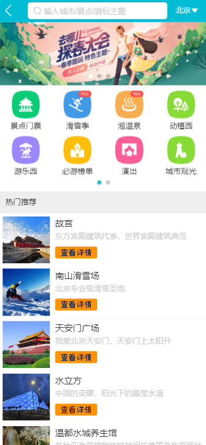
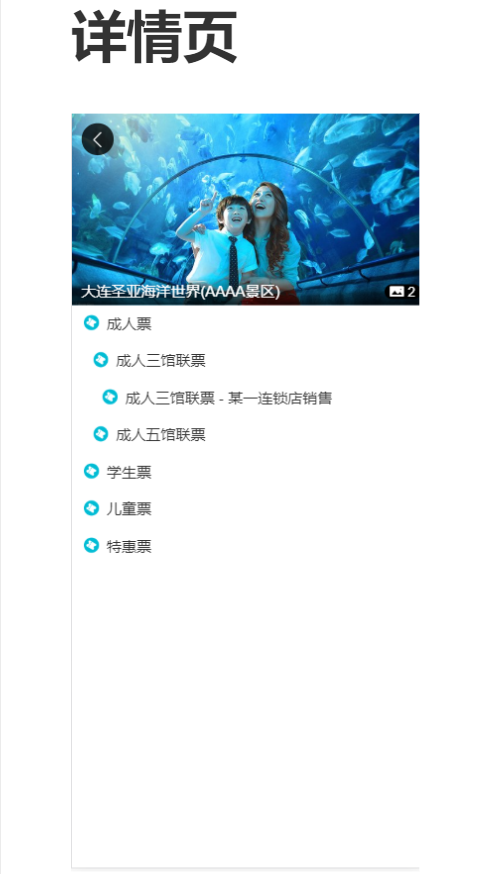

# Vue开发去哪儿核心页面

## 项目涉及到技术栈：
1. Vue、Vue-router、Vuex、Vue-cli
2. 插件：vue-awesome-swiper、better-scroll、axios、fastclick
3. CSS的预处理框架：stylu

## 项目主要效果展示

<!-- <figure class="third">

</figure> -->
<!-- ### 首页

### 城市列表页

### 详情页
 -->

## 项目开发流程

### 项目初始化
1. 环境配置
2. 项目代码结构
3. 单文件组建与路由
4. 单页应用与多页应用
5. 项目代码初始化

### 首页开发
1. Header制作
2. Iconfont的引入
3. 首页轮播
4. 图标区域实现
5. 热销推荐与周末游组件
6. 使用axios获取接口数据
7. 首页父子组件间数据的传递

### 城市选择页面开发
1. 路由配置
2. 搜索框布局
3. Better-scroll的使用和字母表布局
4. 兄弟组建间的传值
5. 列表性能优化
6. 搜索逻辑实现
7. Vuex实现数据共享
8. LocalStorage实现页面数据持久存储
9. 使用keep-alive优化路由页面性能

### 详情页面开发
1. 动态路由配置及banner布局
2. 公用画廊组件拆分
3. 渐隐渐显的header效果实现
4. 递归组件实现详情列表
5. 画廊动画效果封装

